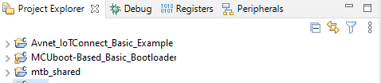

## Introduction

This document demonstrates the steps of setting up the Infineon PSoC&trade; 6 boards
for connecting to Avnet's IoTConnect Platform. Supported boards are listed in 
the [README.md](README.md).

The guide has been tested with the Eclipse option in Project Creator.  

## Prerequisites
* PC with Windows. The project is tested with Windows 10, though the setup should work with Linux or Mac as well.
* USB-A to micro-USB data cable
* 2.4GHz WiFi Network
* A serial terminal application such as [Tera Term](https://ttssh2.osdn.jp/index.html.en) or a browser-based application like [Google Chrome Labs Serial Terminal](https://googlechromelabs.github.io/serial-terminal/)
* A registered [myInfineon Account](https://www.infineon.com/sec/login)

## Hardware Setup
* Connect the board to a USB port on your PC. A new USB device should be detected.
Firmware logs will be available on that COM port.
* Open the Serial Terminal application and configure as shown below:
  * Port: (Select the COM port with the device)
  * Speed: `115200`
  * Data: `8 bits`
  * Parity: `none`
  * Stop Bits: `1`
  * Flow Control: `none`
  
## Building the Software
> If you wish to contribute to this project or work with your own git fork,
> or evaluate an application version that is not yet released, the setup steps will change 
> the setup steps slightly.
> In that case, read [DEVELOPER_LOCAL_SETUP.md](./DEVELOPER_LOCAL_SETUP.md) 
> before continuing to the steps below.

- Download, install [ModusToolbox&trade; software](https://www.infineon.com/cms/en/design-support/tools/sdk/modustoolbox-software/)
version 3.2 or later. Install the development suite with Modus Toolbox&trade; Setup. 
Ensure that *Modus Toolbox&trade; Tools Package* and *Modus Toolbox&trade; Programming tools* are selected during setup. 
The setup tool may require you to log into your Infineon account.
- Open the Project Creator.
- Select one of the supported boards from [README.md](README.md) and click *Next*.
- At the top of the window, choose a path where the project will be installed.
On Windows, ensure that this path is *short* starting from a root of a drive like *C:\iotc-xensiv*,
or else ong paths will trigger the 256 Windows path limit and cause compiling errors. Refer to the
[Troubleshooting](#troubleshooting) section of this document for more information.
- Select *Eclipse IDE for Modus Toolbox&trade;* in the pulldown below the installation path. 
VsCode integration and other tools may work, but actively tested and not a part of this guide.
- Select the *Avnet IoTConnect Optiga Example* from the *Peripherals* Category.
- Click the *Create* button at the bottom of the screen.
- Open the installed Eclipse IDE For Modus Toolbox&trade; application.
- When prompted for the workspace, choose an arbitrary location for your workspace and click the *Launch* button.
- Click the **Import Existing Application In-Place** link in the *Quick Panel* at the bottom left of the window.
- Select the directory chosen during the Project Creator step above (*C:\iotc-xensiv*, for example).
- At this point you should be able to build and run the application by clicking the application first in 
the project explorer panel and then clicking the *application-name-Debug* or *Program* *KitProg3_MiniProg4 
launch configurations in *Quick Panel* at the bottom left of the IDE screen.
- Examine the console messages on the serial terminal. Once the device boots up,
it will print the auto-generated DUID (Device Unique ID) that you will use to 
create the device in the steps at [Cloud Account Setup](#cloud-account-setup) below in this guide:
``` 
Generated device unique ID (DUID) is: psoc6-xxxxxxxx
```
- Once the Cloud Account Setup is complete,
At **Avnet_IoTConnect_Optiga_Example/config/** modify **app_config.h** per your
IoTConnect device setup **wifi_config.h** per your WiFi connection settings.
- Debug or Program the application.

## Cloud Account Setup
An IoTConnect account is required.  If you need to create an account, a free 2-month subscription is available.

Please follow the 
[Creating a New IoTConnect Account](https://github.com/avnet-iotconnect/avnet-iotconnect.github.io/blob/main/documentation/iotconnect/subscription/subscription.md)
guide and select one of the two implementations of IoTConnect: 
* [AWS Version](https://subscription.iotconnect.io/subscribe?cloud=aws)  
* [Azure Version](https://subscription.iotconnect.io/subscribe?cloud=azure)  

* Be sure to check any SPAM folder for the temporary password.

### Acquire IoTConnect Account Information

* Login to IoTConnect using the corresponding link below to the version to which you registered:  
    * [IoTConnect on AWS](https://console.iotconnect.io) 
    * [IoTConnect on Azure](https://portal.iotconnect.io)

* The Company ID (**CPID**) and Environment (**ENV**) variables are required to be stored into the device. Take note of these values for later reference.
<details><summary>Acquire <b>CPID</b> and <b>ENV</b> parameters from the IoTConnect Key Vault and save for later use</summary>

</details>


#### IoTConnect Device Template Setup

An IoTConnect *Device Template* will need to be created or imported.
* Download the premade  [Device Template](files/psoc6-device-template.json).
* Import the template into your IoTConnect instance:  [Importing a Device Template](https://github.com/avnet-iotconnect/avnet-iotconnect.github.io/blob/main/documentation/iotconnect/import_device_template.md) guide  
> **Note:**  
> For more information on [Template Management](https://docs.iotconnect.io/iotconnect/user-manuals/devices/template-management/) please see the [IoTConnect Documentation](https://iotconnect.io) website.

#### IoTConnect Device Creation

* Create a new device in the IoTConnect portal. (Follow the [Create a New Device](https://github.com/avnet-iotconnect/avnet-iotconnect.github.io/blob/main/documentation/iotconnect/create_new_device.md) guide for a detailed walkthrough.)
* Enter the **DUID** noted from earlier into the *Unique ID* field
* Enter the same DUID or descriptive name of your choosing as *Display Name* to help identify your device
* Select the template from the dropdown box that was just imported ("psoc6mtb")
* Ensure "Auto-generated" is selected under *Device certificate*
* Click **Save & View**
* In the info panel, click the Connection Infohyperink on top right and 
download the certificate by clicking the download icon on the top right
.
* You will need to open the device certificate and private key files and 
provide them in configs/app_config.h formatted specified as a C string #define like so:
  ```
  #define IOTCONNECT_DEVICE_CERT \
  "-----BEGIN CERTIFICATE-----\n" \
  "MIICwTCCAakCFFUmScR+Y+XTcu0YKMQcFDXSENLKMA0GCSqGSIb3DQEBCwUAMB0x\n" \
  "GzAZBgNVBAMMEmF2dGRzLWlvdGNlZjJmNDAyMjAeFw0yNDA1MDIxOTEyMzRaFw0y\n" \
  "NTA1MDIxOTEyMzRaMB0xGzAZBgNVBAMMEmF2dGRzLWlvdGNlZjJmNDAyMjCCASIw\n" \
  "DQYJKoZIhvcNAQEBBQADggEPADCCAQoCggEBANA1q0MJwVLGn2uz7O/I2Wo80vnf\n" \
  "ho+U/LW7bHW3JkzrkWIsc2cnT9fDhbSHmUkNlj5yUl+DtsM5LlAV/QO+EHd1xubU\n" \
  "fmtXmk+/vB5g4OhGAI                               CvxlEqm2jW239sU\n" \
  "po153s2XPfO0A0NN8L                               PPTVVA/SlwmuKOp\n" \
  "YdtfTzhdBNiPtnt6xP      THIS IS AN EXAMPLE       mP25wfeCeNh1e64\n" \
  "KWMVsY1wBsPLsC7KmC                               aIaEJsTRiECAwEA\n" \
  "ATANBgkqhkiG9w0BAQ                               quxEn1IkGjmNF2I\n" \
  "m/3+BM/2qPTxZVnfZfgKr3xD3hedymY0JRiKHKZGVWQSClobrbL5p6DraYBwWSFe\n" \
  "h/lKhhBl0quu1vqXPhbMQaVcrBh4NGU8uDi3kezytqVhewR7wru/V3pdwvSer+Am\n" \
  "qr5Sg/2HGybLHGsYhiRqU6bEYhPUzmQJs5FBR9HPd1xsME0qP6MW9FnR7S06G+z4\n" \
  "UkWMseIlcxY6mGViLZGS362rAOAFQE9QYA9qdWyM+AIvjZjlQCbkTOiaEd6GXQIU\n" \
  "khPBBRXBKbDpQ02LgX6tsJUEbGbnPC94LfwnkTuVx/CFKWZfmg==\n" \
  "-----END CERTIFICATE-----"
  ```
  The same format needs to be used for the private key as `#define IOTCONNECT_DEVICE_KEY`

## Enabling the OTA Feature
If you wish to test the OTA feature, you can follow these steps to enable it for your project. 

The OTA feature only works with the boards below:
- [PSoC&trade; 6 Wi-Fi Bluetooth&reg; prototyping kit](https://www.infineon.com/CY8CPROTO-062-4343W) (`CY8CPROTO-062-4343W`)
- [PSoC&trade; 62S2 Wi-Fi Bluetooth&reg; pioneer kit](https://www.infineon.com/cms/en/product/evaluation-boards/cy8ckit-062s2-43012/) (`CY8CKIT-062S2-43012`)

The [mtb-example-psoc6-mcuboot-basic](https://github.com/Infineon/mtb-example-psoc6-mcuboot-basic) code example bundles two applications: the bootloader app that runs on CM0+, and the Blinky app that runs on CM4. For this code example, only the bootloader app is required and the root directory of the bootloader app is referred to as *\<MCUboot-Based_Basic_Bootloader/ bootloader_cm0p>* in this document.

Import the [mtb-example-psoc6-mcuboot-basic](https://github.com/Infineon/mtb-example-psoc6-mcuboot-basic) code example. 
  * Open **New Application** on the bottom left panel in Modustoolbox.
  * Select your board in the pop-up window, then Click **Next**.
  * Select the application **MCUboot-Based_Basic_Bootloader**, then **Create**.
  * After successfully importing the bootloader project, the workspace will be as below:
  
    
  
* Project structure explanation:

  * The bootloader project and Avnet_IoTConnect_Basic_Example project should be built and programmed independently. They must be placed separately in the same workspace.
  * You must first build and program the MCUboot bootloader project into the CM0+ core; this should be done only once. The Avnet basic example app can then be programmed into the CM4 core; you need to only modify this app for all application purposes.
  * The bootloader and Avnet basic example applications must have the same understanding of the memory layout. The memory layout is defined through JSON files. The ota-update library provides a set of predefined JSON files that can be readily used. Both the bootloader and Avnet application must use the same JSON file.


* Setup the MCU bootloader project:
  * The *\<mtb_shared>/iotc-modustoolbox-sdk/\<tag>/ota-update//configs/flashmap/* folder contains the pre-defined flashmap JSON files. The following file is supported by this example.

     Target      | Supported JSON files
     ----------- |----------------------------------
     CY8CPROTO-062-4343W <br> | Board supports the following flashmaps : <br> *psoc62_2m_ext_swap_single.json* <br> 
  
   <br>

  * Copy the flashmap **psoc62_2m_ext_swap_single.json** and paste it in the *\<bootloader_cm0p>/flashmap* folder.

  * Modify the value of the `FLASH_MAP` variable in  *\<bootloader_cm0p>/shared_config.mk* to `psoc62_2m_ext_swap_single.json`.

  * Copy the *\<mtb_shared>/mcuboot/\<tag>/boot/cypress/MCUBootApp/config* folder and paste it into the *\<bootloader_cm0p>* folder.

  * Edit the *\<bootloader_cm0p>/config/mcuboot_config/mcuboot_config.h* file and comment out the following defines to skip checking the image signature:

     ```
     //#define MCUBOOT_SIGN_EC256
     .
     //#define MCUBOOT_VALIDATE_PRIMARY_SLOT
     ```

  * Edit *\<bootloader_cm0p>/app.mk* and replace the MCUboot include `$(MCUBOOTAPP_PATH)/config` with `./config`. This gets the build system to find the new copy of the *config* directory that you pasted into the *\<bootloader_cm0p>* directory, instead of the default one supplied by the library.

  * Build and program the application. After programming, the bootloader application starts automatically.


#### Update Files/Flags for OTA

* Comment out "$(SEARCH_avnet-iotc-mtb-sdk)/lib/ota-update" in .cyignore file.
* Uncomment "DEFINES+=OTA_SUPPORT" and change "OTA_SUPPORT=0" to "OTA_SUPPORT=1" in makefile.
* Update the "CY_OTA_CHUNK_SIZE" to 0x6000 in the lib file(mtb-shared/iotc-modustoolbox-sdk/\<tag>/ota-udpate/include/cy_ota_api.h).
* Update the chunk buffer to "uint8_t chunk_buffer[CY_OTA_CHUNK_SIZE + 1024]" in the lib file(mtb-shared/iotc-modustoolbox-sdk/\<tag>/ota-udpate/source/cy_ota_internal.h).

#### Setting up Firmware on IoTConnect for OTA

* Navigate to Device -> Device, click **Firmware** on the bottom panel.
* Upload the .bin format OTA firmware under your template and click **Save**.
* When pushing OTA update, click *Released* or *Draft* number under your template, the click the first "test OTA" icon as the image shown below.
* Select your "Device" and "Template", then click **Update** icon to push the OTA update to your board. IoTConnect will send your board the OTA packages and the info will show up on the log. 
* After a successful OTA, the board will restart itself and boot the new image as the log below.
```
APP CB OTA Session Complete
[F5] : [L2] : 0154 00:05:58.280 cy_ota_complete()
```

 
