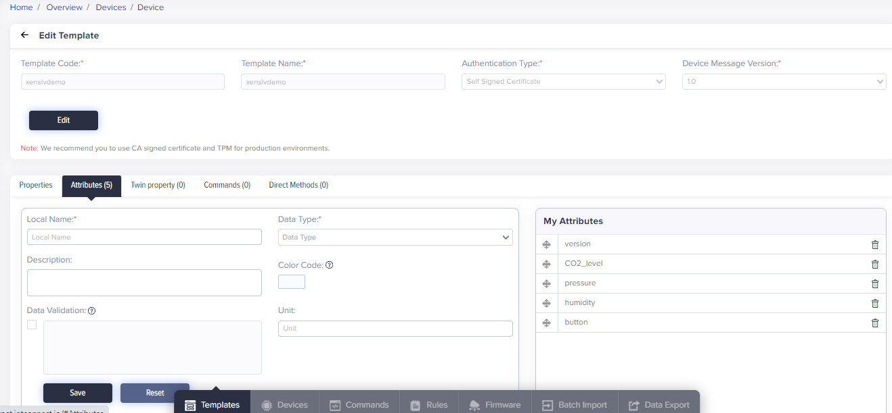
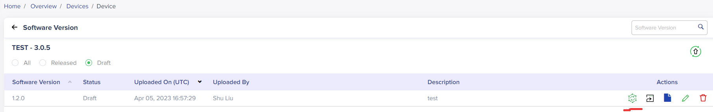

## Introduction

This document demonstrates the steps of setting up the Infineon PSoC&trade; 6 boards
for connecting to Avnet's IoTConnect Platform. Supported boards are listed in the [README](https://github.com/avnet-iotconnect/iotc-modustoolbox-example/blob/main/README.md).

## Hardware Setup

* The board needs to be connected to a USB port on your PC via the Micro USB cable.
* In the Modustoolbox IDE, use Program/Debug (KitProg3_MiniProg4) configuration in the Quick Panel on the bottom left.
* Once the board boots up, a new USB devices will be available. 
  * Optionally, connect a terminal program (like TeraTerm) to one of the two COM ports
which is named "USB Serial". Use defaults for 115200 baud: 8 bits, 1 stop bit, no flow control or parity. 
Firmware logs will be available on that COM port. 


## Software Setup
- Download, install and open [ModusToolbox&trade; software](https://www.cypress.com/products/modustoolbox-software-environment) v3.0.0 or later (tested with v3.0.0). On Windows, ensure that you **Run As Adminstrator** the installation package so that the neccessary drivers can be installed.
- Select a name for your workspace when prompted for a workspace name.
- Click the **New Application** link in the **Quick Panel** (or, use **File** > **New** > **ModusToolbox Application**). This launches the [Project Creator](https://www.cypress.com/ModusToolboxProjectCreator) tool.
- Pick a kit supported by the code example from the list shown in the **Project Creator - Choose Board Support Package (BSP)** dialog and click **Next**
- In the **Project Creator - Select Application** dialog, Click the checkbox of the project **Avnet IoTConnect Basic Example** under **Wi-Fi** catergory and then click **Create**. 
- Modify **Avnet_IoTConnect_Basic_Example/configs/app_config.h** per your IoTConnect device and account & security info.
- Modify **Avnet_IoTConnect_Basic_Example/configs/wifi_config.h** with your WIFI_SSID and WIFI_PASSWORD.
- At this point you should be able to build and run the application by using the options in the **Quick Panel** on bottom left of the screen.   
- You should see the application output in your terminal emulator.
- if OTA is not required, you can jump to the topic [IoTConnect Template Setup](https://github.com/avnet-iotconnect/iotc-modustoolbox-example/blob/main/QUICKSTART_DEMO.md#iotconnect-template-setup)

**Note**: OTA only works with the board [PSoC&trade; 6 Wi-Fi Bluetooth&reg; prototyping kit](https://www.infineon.com/CY8CPROTO-062-4343W) (`CY8CPROTO-062-4343W`).

## Project Structure for OTA

* For OTA, we will need a dual-core project, where the **MCUboot bootloader** app runs on the CM0+ core and the **Avnet_IoTConnect_Basic_Example** app runs on the CM4 core.

* The bootloader project and Avnet_IoTConnect_Basic_Example project should be built and programmed independently. They must be placed separately in the workspace as you would do for any other two independent projects. An example workspace will be as follows:

   ```
   <project-explorer>
      |
      |-<mtb-example-psoc6-mcuboot-basic>
      |-<mtb-shared>
      |-<Avnet-IoTConnect-Basic-example>
      |
   ```

* You must first build and program the MCUboot bootloader project into the CM0+ core; this should be done only once. The Avnet basic example app can then be programmed into the CM4 core; you need to only modify this app for all application purposes.

## Import MCU Bootloader Project for OTA

The [mtb-example-psoc6-mcuboot-basic](https://github.com/Infineon/mtb-example-psoc6-mcuboot-basic) code example bundles two applications: the bootloader app that runs on CM0+, and the Blinky app that runs on CM4. For this code example, only the bootloader app is required and the root directory of the bootloader app is referred to as *\<bootloader_cm0p>* in this document.

* Import the [mtb-example-psoc6-mcuboot-basic](https://github.com/Infineon/mtb-example-psoc6-mcuboot-basic) code example per the instructions in the [Using the code example](https://github.com/Infineon/mtb-example-psoc6-mcuboot-basic#using-the-code-example) section of its [README](https://github.com/Infineon/mtb-example-psoc6-mcuboot-basic/blob/master/README.md).

* The bootloader and Avnet basic example applications must have the same understanding of the memory layout. The memory layout is defined through JSON files. The ota-update library provides a set of predefined JSON files that can be readily used. Both the bootloader and Avnet application must use the same JSON file.

   The *\<mtb_shared>/ota-update/\<tag>/configs/flashmap/* folder contains the pre-defined flashmap JSON files. The following files are supported by this example.

   Target      | Supported JSON files
   ----------- |----------------------------------
   CY8CPROTO-062-4343W <br> | Board supports the following flashmaps : <br> *psoc62_2m_ext_overwrite_single.json* <br> *psoc62_2m_ext_swap_single.json* <br> 


   <br>

   Copy the required flashmap JSON file and paste it in the *\<bootloader_cm0p>/flashmap* folder.

* Modify the value of the `FLASH_MAP` variable in  *\<bootloader_cm0p>/shared_config.mk* to the selected JSON file name from the previous step.

* Copy the *\<mtb_shared>/mcuboot/\<tag>/boot/cypress/MCUBootApp/config* folder and paste it into the *\<bootloader_cm0p>* folder.

* Edit the *\<bootloader_cm0p>/config/mcuboot_config/mcuboot_config.h* file and comment out the following defines to skip checking the image signature:

   ```
   #define MCUBOOT_SIGN_EC256
   .
   #define MCUBOOT_VALIDATE_PRIMARY_SLOT
   ```

* Edit *\<bootloader_cm0p>/app.mk* and replace the MCUboot include `$(MCUBOOTAPP_PATH)/config` with `./config`. This gets the build system to find the new copy of the *config* directory that you pasted into the *\<bootloader_cm0p>* directory, instead of the default one supplied by the library.

* Build and program the application per the [Step-by-step](https://github.com/Infineon/mtb-example-psoc6-mcuboot-basic#step-by-step-instructions) instructions in its [README](https://github.com/Infineon/mtb-example-psoc6-mcuboot-basic/blob/master/README.md).

    After programming, the bootloader application starts automatically.


## Setup Application for OTA

* Update OTA HTTP_SERVER, HTTP_SERVER_PORT and ROOT_CA_CERTIFICATE in the file (/source/ota_app_config.h).
* Update the "CY_OTA_CHUNK_SIZE" to 0x6000 in the lib file(mtb-shared/ota-udpate/tag/include/cy_ota_api.h).
* Update the chunk buffer to "uint8_t chunk_buffer[CY_OTA_CHUNK_SIZE + 1024]" in the lib file(mtb-shared/ota-udpate/tag/source/cy_ota_internal.h).

## IoTConnect Template Setup

* Login to the IoTConnect platform, navigate to Devices -> Device -> Templates and click "Create Template."
  * Enter a name like "mtbdemo" for **Template Code** and **Template Name**. 
  * Select *Self Signed Certificate* or *CA Certificate* in the **Authentication Type** pulldown.
  * Ensure that **Device Message Version** is **1.0**
  * Click **Save**
* On the same page, click the Attributes tab.
* You can add some attributes to the list of attributes, for example:
  * *cpu*  - "NUMBER"
  * *version*     - "STRING"
* The screenshot below shows an example template:




## Setting up the Device on IoTConnect
 
* Navigate to Device -> Device and click the **Create Device** button.
* Enter your device unique ID.
* Choose your entity where you will create the device.
* Select the Template that was created in a previous step.
* Enter the [fingerprint of your certificate](#Obtaining-the-Device-Certificate-Fingerprint). 
* Click **Save**.


## Setting up Firmware on IoTConnect for OTA

* Navigate to Device -> Device, click **Firmware** on the bottom panal.
* Upload the .bin format OTA firmware under your template and click **Save**.
* When pushing OTA update, click *Released* or *Draft* number under your template, the click the first "test OTA" icon as the image shown below.
* Select your "Device" and "Template", then click **Update** icon to push the OTA update to your board. IoTConnect will send your board the OTA packages and the info will show up on the log. 
* After a successful OTA, the board will restart itself and boot the new image as the log below.
```
APP CB OTA Session Complete
[F5] : [L2] : 0154 00:05:58.280 cy_ota_complete()   RESETTING NOW !!!! This takes a few minutes.
```


## Appendix

### Obtaining the Device Certificate Fingerprint

This section outlines how to set up the device for IoTConnect Self Signed Certificate or CA Certificate authentication type.
Steps for other authentication types are out of scope for this guide.

* Obtain the fingerprint of device certificate.
   * Generate your certificate in PEM format.
   * The fingerprint of the certificate can be either SHA256 or SHA1.
   * You can execute ``` openssl x509 -noout -fingerprint -inform pem -in cert.pem ``` if openssl is installed.
   * The contents of *cert.pem* can be pasted into an online fingerprint calculator such as [this one](https://www.samltool.com/fingerprint.php). 

  
Note that publishing the device certificate or fingerprint online is not technically unsafe 
because the certificate must be paired by the private key derived data during authentication. 
The private key is securely stored on the device and cannot be accessed even programmatically.
The only information that may potentially "leak" by using a public web site in this fashion is the informational 
manufacturer data, including the device serial number. Below is a sample screenshot:

