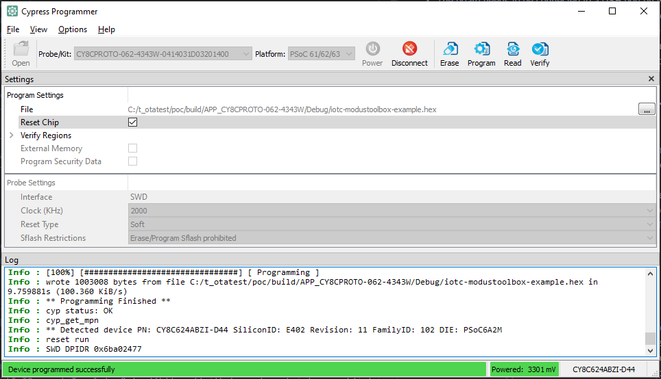

## Introduction

This document demonstrates the steps of setting up the Infineon PSoC&trade; 6 boards
for connecting to Avnet's IoTConnect Platform. Supported boards are listed in the [README](https://github.com/avnet-iotconnect/iotc-modustoolbox-example/blob/main/README.md).

## Hardware Setup

* The board needs to be connected to a USB port on your PC via the Micro USB cable.
* In the Modustoolbox IDE, use Program/Debug (KitProg3_MiniProg4) configuration in the Quick Panel on the bottom left.
* Once the board boots up, a new USB devices will be available. 
  * Optionally, connect a terminal program (like TeraTerm) to one of the two COM ports
which is named "USB Serial". Use defaults for 115200 baud: 8 bits, 1 stop bit, no flow control or parity. 
Firmware logs will be available on that COM port. 

## Load the prebuild firmware onto the board
* Download the [Cypress Programmer](https://softwaretools.infineon.com/tools/com.ifx.tb.tool.cypressprogrammer?_ga=2.62648364.1833039610.1681757143-213784066.1663170031).
* Launch the programmer software, **Open** the hex firwmare on the top left and Click **Connect**.
* There are two firmware. One is for the bootloader and the other is the application firmware. Program the bootloader first and then the application firmware.
* Click **Program** button on the top right and wait for the propress bar to be done as the image show below.
* If successful, the log will show up on the terminal program.
* For the developer and IDE, please use the [QUICKSTART_DEMO](https://github.com/avnet-iotconnect/iotc-modustoolbox-example/blob/main/QUICKSTART_DEMO.md) guide

